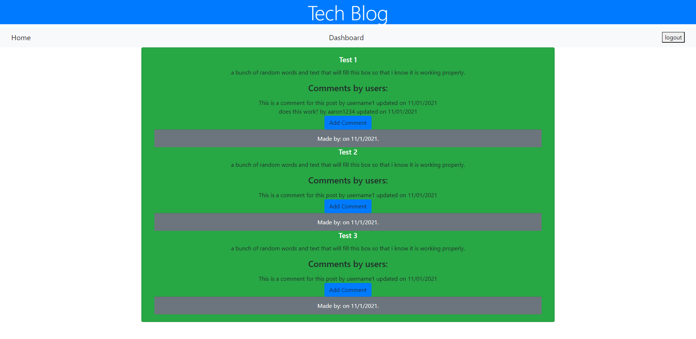
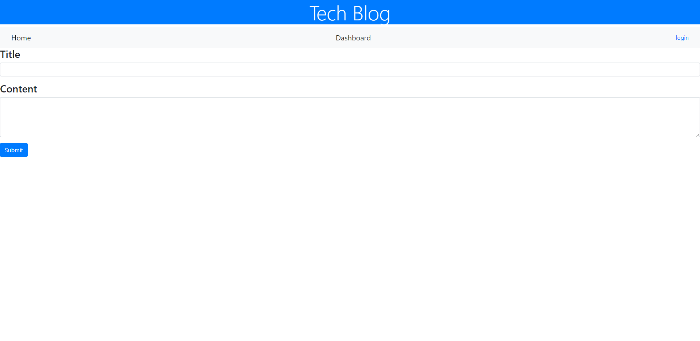
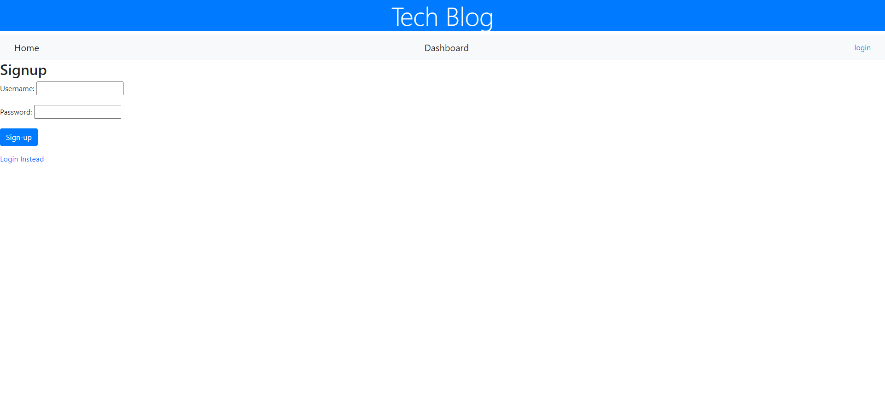
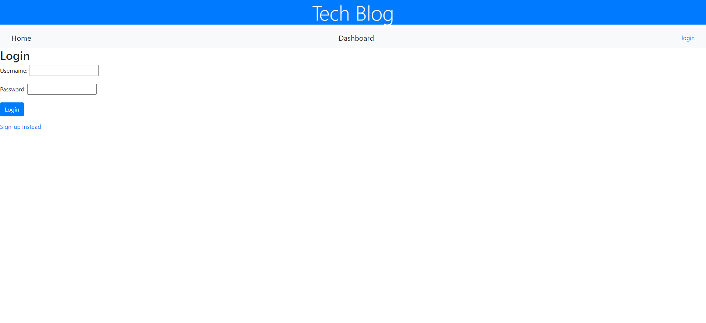

# Tech_blog

## Description

- The motivation for this project was to create a MVC blog.  
- I built this project to increase my skillset and knowledge with MVC's 
- This projet is a simple blog which can be used by anyone to post blogs and comments on those blogs 
- Taking on this project was very challenging but I learned alot in doing this specifically the relationship between the routes and models. 

## Table of Contents 
- [Installation](#installation)
- [Usage](#usage)
- [Credits](#credits)
- [License](#license)

## Installation
The full project can be accessed from the deployed heroku link seen here -->  https://git.heroku.com/techblog1234.git
## Usage
To test this application. First sign up with a new username and password. Once you have signed up you can go to the dashboard to add a new post. If you would like to make a comment on someones blog post you can click the "add comment" button type your comment in the text box and click save. It will then post your comment underneath the blog with a time stamp of when you made comment and your username for tracking purposes.

## Credits
Shout out to my tutor Phillip Loy for expanding my knowledge base which enabled me to get this application completely working.

## Badges

## Tests
To test this application. First sign up with a new username and password. Once you have signed up you can go to the dashboard to add a new post. If you would like to make a comment on someones blog post you can click the "add comment" button type your comment in the text box and click save. It will then post your comment underneath the blog with a time stamp of when you made comment and your username for tracking purposes. 

## License
- MIT License

Copyright (c) [2021] [Aaron Donelson]

Permission is hereby granted, free of charge, to any person obtaining a copy of this software and associated documentation files (the "Software"), to deal in the Software without restriction, including without limitation the rights to use, copy, modify, merge, publish, distribute, sublicense, and/or sell copies of the Software, and to permit persons to whom the Software is furnished to do so, subject to the following conditions:

The above copyright notice and this permission notice shall be included in all copies or substantial portions of the Software.

THE SOFTWARE IS PROVIDED "AS IS", WITHOUT WARRANTY OF ANY KIND, EXPRESS OR IMPLIED, INCLUDING BUT NOT LIMITED TO THE WARRANTIES OF MERCHANTABILITY, FITNESS FOR A PARTICULAR PURPOSE AND NONINFRINGEMENT. IN NO EVENT SHALL THE AUTHORS OR COPYRIGHT HOLDERS BE LIABLE FOR ANY CLAIM, DAMAGES OR OTHER LIABILITY, WHETHER IN AN ACTION OF CONTRACT, TORT OR OTHERWISE, ARISING FROM, OUT OF OR IN CONNECTION WITH THE SOFTWARE OR THE USE OR OTHER DEALINGS IN THE SOFTWARE.

